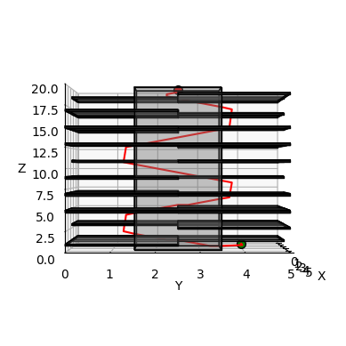

# Motion planning for navigation in 3D space

This project was completed as part of **ECE 276B – Planning and Learning in Robotics**, taught by **Prof. Nikolai Atanasov** at the **University of California, San Diego**. The work implement and compare the performance of search-based and sampling-based motion planning algorithms on several 3-D environments.

### 1. Planner.py
This file contains an implementation of a baseline planner. The baseline planner gets stuck in complex environments and is not very careful with collision checking. Modify this file in any way necessary for your own implementation.

### 2. astar.py
This file contains a class defining a node for the A* algorithm as well as an incomplete implementation of A*. Feel free to continue implementing the A* algorithm here or start over with your own approach.

### 3. rrt_star.py
Implements the RRT\* algorithm using OMPL with a 3D state space and custom collision checking. 

### 4. maps
This folder contains 7 test environments described via a rectangular outer boundary and a list of rectangular obstacles. The start and goal points for each environment are specified in main.py.

## Results Across 7 Environments

Below are visual results for each of the 7 test environments. Each section contains:

- A\* 
- RRT\* 

<!-- Begin environment image table sections -->

### Environment 1 - Single Cube

<table>
  <tr>
  <th style="text-align:center;">A* Result</th>
  <th style="text-align:center;">RRT* Result</th>
</tr>
  <tr>
    <td></td>
    <td></td>
  </tr>
</table>

### Environment 2 - Maze

<table>
  <tr>
    <td></td>
    <td></td>
  </tr>
</table>

### Environment 3 - Flappy Bird

<table>
  <tr>
    <td></td>
    <td></td>
  </tr>
</table>

### Environment 4 - Pillars

<table>
  <tr>
    <td></td>
    <td></td>
  </tr>
</table>

### Environment 5 - Window

<table>
  <tr>
    <td></td>
    <td></td>
  </tr>
</table>

### Environment 6 - Tower

<table>
  <tr>
    <td></td>
    <td></td>
  </tr>
</table>

### Environment 7 - Room

<table>
  <tr>
    <td></td>
    <td></td>
  </tr>
</table>

---

### Path Cost Comparison (Lower is Better)

| Environment   | Greedy A\* | Weighted A\* | RRT\*  |
|---------------|------------|--------------|--------|
| Cube          | 8.00       | 7.99         | 7.89   |
| Maze          | 1000.00    | 76.23        | 75.19  |
| Flappy bird   | 1000.00    | 31.34        | 29.49  |
| Pillars       | 1000.00    | 31.06        | 28.75  |
| Window        | 1000.00    | 27.78        | 25.89  |
| Tower         | 1000.00    | 29.78        | 29.79  |
| Room          | 1000.00    | 11.72        | 10.92  |

---

### Heuristic Comparison: Euclidean vs Manhattan

These GIFs visualize the behavior of A\* with two different heuristics:

- **Euclidean Distance**
- **Manhattan Distance**

The animations show the order in which nodes are expanded during planning.  

<table>
  <tr>
  <th style="text-align:center;">Euclidean</th>
  <th style="text-align:center;">Manhattan</th>
</tr>
  <tr>
    <td></td>
    <td></td>
  </tr>
  <tr>
    <td></td>
    <td></td>
  </tr>
</table>

